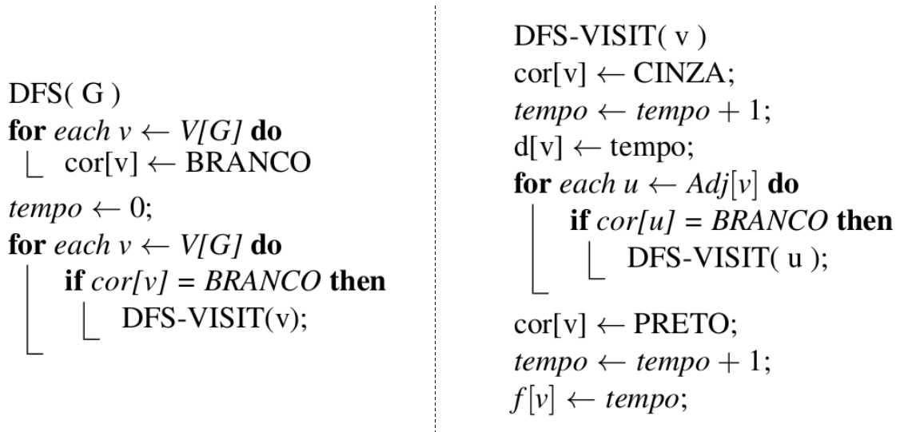

# depth-first search

 
 
 
 

 

 

Algoritmos de busca são desenvolvidos com o objetivo de proporcionar formas de se visitar todos os vértices (V) de um grafo (G). Para tanto, utiliza-se meios de exploração ou varredura a partir das relações de adjacencia providas pelas ligações de arestas (E). Dado $G = {V,E}$ um grafo qualquer, um algoritmo de busca pode optar por (a) visitar, para cada vértice $v$, todas as relações de adjacencia (<a href="https://github.com/mpiress/graph_bfs">BFS</a>) a cada interação antes de avançar para novos vértices ou (b) visitar, a partir de um vértice $v$ qualquer, os caminhos em profundidade que partem de $v$ e tem como destino todos os demais vérticies em G. Neste tutorial, trataremos do segundo caso, conhecimo como algoritmo de busca depth-first search (DFS). 

No DFS, o objetivo é identifiar se determinado vértice $u$ é atingível a partir de uma origem $v$, tal que $v \rightarrow u$. Para tanto, o algoritmo explora $v$ escolhendo, dentre seus vértices adjacentes, um vértice $w$ aleatório e desse inicializa uma busca em profundidade. Estando em $w$, esse vértice é numerado duas vezes, uma vez para indicar o tempo de descoberta e outra para informar o tempo de finalização da exploração de sua lista de adjacencia.    

Para compor um processo eficaz e que evite ciclos de execução, o DFS atribui o primeiro valor para indicar quando o vértice foi conhecido, ou seja, atingível de alguma forma a partir de $|E + V|$. Esse valor é abstraído do número de interações realizadas até alcançar o vértice propriamente dito. Quanto esse vértice é totalmente explorado, ou seja, tem sua lista de adjacencia investigada, esse recebe um segundo valor para informa em qual interação da execução ele foi completamente explorado. A Fig 1 detalha um pequeno exemplo dessa representação para um grafo $G$ qualquer.

   
  <caption>Fig 1. Pequeno exemplo do resultado da execução do DFS em um grafo $G$ aleatório.</caption>

Observe na Fig 1 que uma barra (/) é utilizada para separar visualmente as numerações. Nesse contexto, dado $s$, o vértice de origem, indicado com numeração 1 de descoberta tem sua finalização do ciclo 16, valor atribuído para detalhar que este foi completamente visitado. Note que cada vértice tem anotado como parte de seu conteúdo ambos os valores, sendo o segundo para indicar a finalização da exploração a partir daquele vértice. Esse modelo de busca e exploração é amplamente abordado em literatura e sua aplicação pode ser observada em problemas que envolvam: pré-ordem, exploração de labirintos, <a href="https://www.wikifox.org/pt/wiki/Algoritmo_de_Tremaux">exploração Trémaux</a>, <a href="https://pt.wikipedia.org/wiki/Fio_de_Ariadne_(l%C3%B3gica)#:~:text=O%20Fio%20de%20Ariadne%2C%20assim,l%C3%B3gica%20por%20todos%20os%20meios">fio de Ariadne</a>, Xadrez, entre outros.

# O modelo de execução

Conforme pode-se observar, o DFS atua no grafo identificando o quão distânte da origem ele pode chegar dado uma escolha de vértices aleatórios. Foi apresentado que vértices são dados como descobertos e visitados e que tais informações são úteis para a execução correta e sem ciclos. Para compreender esse processo, considere um modelo de coloração do grafo que classifica seus vértices como segue.

>
> 1. **vértice branco**: vértice não visitado e não conhecido.
> 2. **vértice cinza**: vértice conhecido mas não visitado. Seus adjacentes não foram totalmente explorados.
> 3. **vértice preto**: vértice conhecido e visitado. Todos os seus adjacentes foram visitados e já são, pelo menos, conhecidos. 
>

Considerando o padrão de cores acima citada, sempre que um vértice $v$ é descoberto no curso de varredura do grafo, o vértice é indicado como conhecido e pintado de cinza. Quando a lista de adjacencia de $v$ é totalmente explorada, a cor preta é atribuída ao vértice e a sua numeração de visitado é então informada. A Fig 2 detalha o esquema de cores e numerações adotadas para cada vértice $v \in V$.

   
  <caption>Fig 2. Modelos de representação de vértice para as diferentes cores e numerações adotadas.</caption>

Para projetar a ideia acima apresentada sob um código é preciso estabelecer variáveis auxiliares que consigam gerenciar o sistema de cores, bem como, as atribuições para d e f quanto ao tempo de descoberta. Para tanto, considere como variáveis de apoio: 

>
> **cor[u]**: vetor utilizado para indicar os vértices atingíveis.
> 
> **d[u]**: indica qual o momento do tempo em que $u$ foi descoberto.
>
> **f[u]**: indica qual o momento do tempo em que $u$ foi totalmente visitado.
>
>

Dado as definições de auxiliares acima descritas, tem-se como algoritmo de execução o BFS a seguinte sequência lógica (Fig 3):

   
  <caption>Fig 3. Algoritmo representativo da estratégia DFS segundo Cormen et al [1].</caption>

Observe pela Fig 3 que o algoritmo DFS é dividido em duas chamadas. A função DFS é executada inicialmente para pintar todos os vértices de branco, bem como, para inicializar o contator de ciclos para atribuições de descoberta e visitado. Para cada vértice que permanece em branco, ou seja, desconhecido, é realizada uma chamada à DFS-VISIT. Nessa função, o tempo de descoberta é introduzido, o vértice é pintado de cinza e uma chamada recursiva inicializada. Essa nessa chamada que o caminhamento em profundidade é implementado. 

# Compilação e Execução

A estrutura de grafo disponibilizada possui um arquivo Makefile que realiza todo o procedimento de compilação e execução. Para tanto, temos as seguintes diretrizes de execução:

| Comando                |  Função                                                                                           |                     
| -----------------------| ------------------------------------------------------------------------------------------------- |
|  `make clean`          | Apaga a última compilação realizada contida na pasta build                                        |
|  `make`                | Executa a compilação do programa utilizando o gcc, e o resultado vai para a pasta build           |
|  `make run`            | Executa o programa da pasta build após a realização da compilação                                 |

# Referências

[1] Thomas H. Cormen, Charles E. Leiserson, Ronald L. Rivest, Clifford Stein. Algoritmos:  Teoria e Prática. 3a edição. Elsevier, 2012. ISBN 9788535236996

# Contatos

 

<a style="color:black" href="mailto:michel@cefetmg.br?subject=[GitHub]%20Source%20Dynamic%20Lists">
✉️ <i>michel@cefetmg.br</i>
</a>

